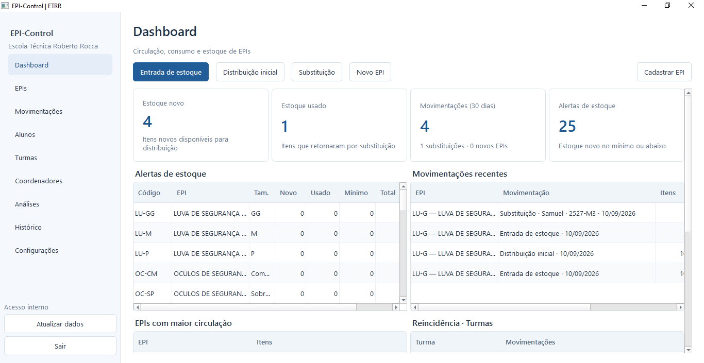
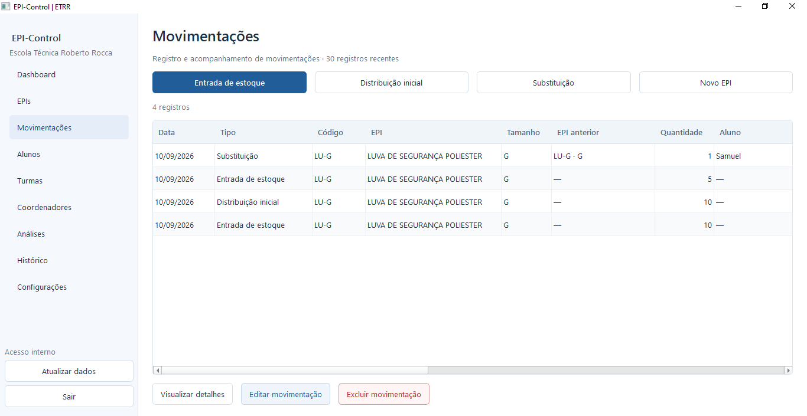
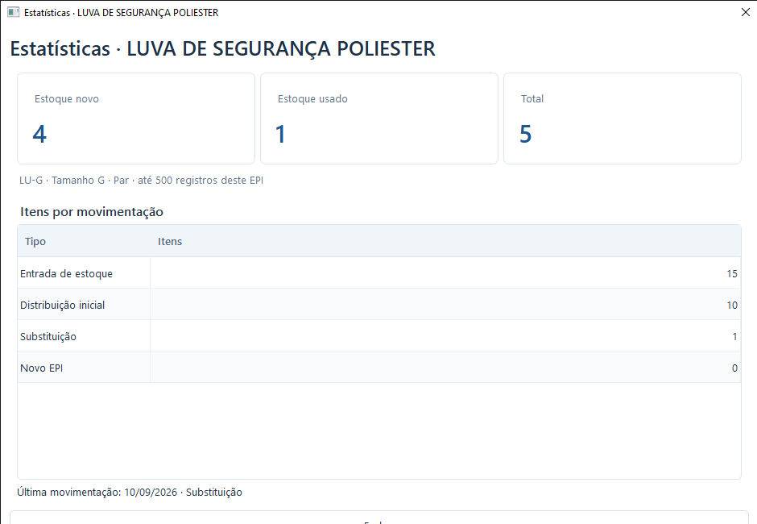
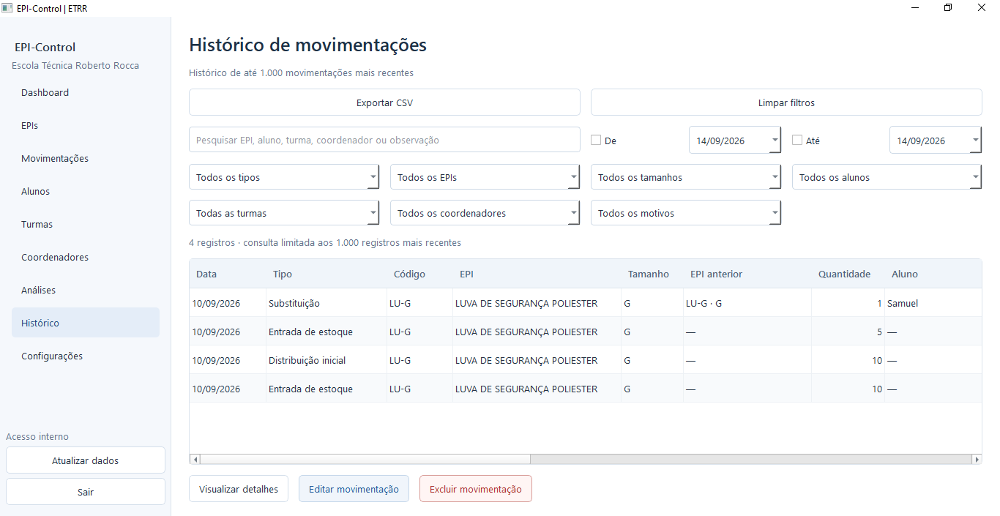

  

# EPI-Control

### Gestão, controle e análise de Equipamentos de Proteção Individual em um só lugar.

O **EPI-Control** é uma aplicação desenvolvida para auxiliar a coordenação da escola na organização, controle e acompanhamento dos Equipamentos de Proteção Individual utilizados na instituição.

---

## Sobre o projeto

O **EPI-Control** surgiu a partir de uma necessidade real da coordenação da **Escola Técnica Roberto Rocca**, com o objetivo de tornar mais simples e eficiente o gerenciamento dos Equipamentos de Proteção Individual.

A aplicação centraliza informações sobre os EPIs, permite registrar movimentações e oferece indicadores para facilitar o acompanhamento dos equipamentos e a análise das informações.

O projeto foi desenvolvido pensando não apenas no armazenamento dos dados, mas também em uma experiência de uso prática e em uma visualização clara das informações para apoiar a gestão.

---

## Principais funcionalidades

- 📊 **Dashboard gerencial** com indicadores gerais do sistema
- 🦺 **Gestão de EPIs** e informações dos equipamentos cadastrados
- 🔄 **Registro de movimentações** de entrada e saída
- 📈 **Área de Analytics** para análise dos dados registrados
- 🔎 **Filtros e consultas** para facilitar a localização das informações
- 📦 **Acompanhamento de estoque** e disponibilidade dos equipamentos
- 🗃️ **Centralização dos dados** em uma única aplicação

---

## Interface do sistema

> As imagens apresentadas utilizam dados fictícios para fins de demonstração e preservação das informações institucionais.

<table>
<tr>

<td width="50%" align="center">

### Dashboard

Visão geral dos principais indicadores, equipamentos e informações do sistema.

</td>

<td width="50%" align="center">

### Movimentações

Área responsável pelo registro e gerenciamento das movimentações de EPIs.

</td>

</tr>

<tr>

<td width="50%" align="center">

### Analytics

Indicadores e visualizações desenvolvidos para facilitar a análise dos dados e das movimentações.

</td>

<td width="50%" align="center">

### Gestão de EPIs

Área dedicada ao gerenciamento dos equipamentos cadastrados e suas principais informações.

</td>

</tr>
</table>

---

## Objetivo

Centralizar e simplificar a gestão dos Equipamentos de Proteção Individual, permitindo acompanhar estoque, movimentações e indicadores por meio de uma aplicação organizada e voltada para uma necessidade real da instituição.

---

## Tecnologias

<!-- Substitua pelos ícones das tecnologias realmente utilizadas no projeto -->

